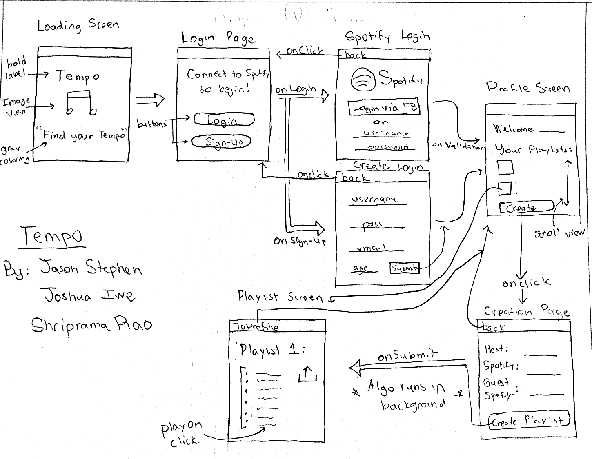

Group Project - README Template
===

# TEMPO

## Table of Contents
1. [Overview](#Overview)
1. [Product Spec](#Product-Spec)
1. [Wireframes](#Wireframes)
2. [Schema](#Schema)

## Overview
### Description
A music app that allows a user to log in through Spotify, allows the user to input several users, combines those several users' tastes into one playlist, and adds that playlist to the user's account. 

### App Evaluation
[Evaluation of your app across the following attributes]
- **Category:**
Music/Social Networking
- **Mobile:**
This app will be primarily developed for mobile use, but its functionality isn't limited to mobile devices.
- **Story:**
Analyzes the music tastes of usernames given, and creates a playlist combining the preferences of all those users.
- **Market:**
Any individual could use this app; it would be beneficial for groups of people to have a playlist they all would enjoy.
- **Habit:**
This app could be used as often as the user wants with several playlists for different groups of people they spend time with or listen to music with. 
- **Scope:**
First we are starting with producing a playlist that takes into account everyone's preferences, but later this could evolve into something that also takes into account a specific mood for the setting and attunes the songs in the playlist to accomodate the requested mood. Large potential for use with spotify, and other music sharing apps. 

## Product Spec

### 1. User Stories (Required and Optional)

**Required Must-have Stories**

* User can log in to Spotify through the Tempo app. 
* User can input Spotify usernames to a text field and press enter. 
* User gets a playlist of 25 songs that combines their tastes using each user's playlists. 
* The customized playlist is added to the account the user logged in with. 

**Optional Nice-to-have Stories**

* User can add theme and customized playlist considers danceability of songs to match theme.
* User can play songs on the customized playlist through Spotify from the Tempo app. 
* The customized playlist contains 100 songs.

### 2. Screen Archetypes

* [Login/Register]
   * [User can log into Spotify account]
   * ...
* [Stream]
   * [User can scroll through previously created playlists]
   * ...
* [Detail]
   * [User can view details of a created playlist]
   * ...
* [Creation]
   * [User can create a new playlist]
   * ...
* [Profile]
   * [User can scroll through previously created playlists]
   * [User can customize settings]
* [Settings]
   * [User can change theme ]
   * [User can change the number of songs per playlist]

### 3. Navigation

**Tab Navigation** (Tab to Screen)

* [Settings]
* [Home]

**Flow Navigation** (Screen to Screen)

* [Loading Screen]
   * [Loading Screen --> Login Page]
   * ...
* [Login Page]
   * [LoginButton --> Spotify Login]
   * [SignUpButton --> Create Login Page]
* [Spotify Screen]
   * [--> Profile Screen]
   * [BackButton --> Login Page]
* [Create login]
   * [SignUpButton --> Profile Screen]
* [Profile Screen]
   * [onTapofPlaylist --> Playlist Screen]
   * [onTapCreateButton --> Creation page]
* [Playlist screen]
   * [toProfilebutton --> Profile Screen]
* [Creation screen]
   * [OnTapCreate Playlist --> Playlist Screen]
   * [BackButton --> ProfileScreen]
   
   
   

   

   

## Wireframes
[Add picture of your hand sketched wireframes in this section]

### [BONUS] Digital Wireframes & Mockups

### [BONUS] Interactive Prototype

## Schema 
**Input**
1. String hostName (Name of person creating playlist)
2. Pointer to User userName (User that is generating playlist) 
3. String playlistName (Name of playlist being generated)
4. Pointer to User guestUsers (Usernames of people to merge with)

**Output**
1. String hostName (Name of person creating playlist)
2. Pointer to playlist playlistPointer (Playlists owned by host)
3. Array of pointers to songs playlistSongs (Songs in the playlist)

### Models
[Add table of models]
### Networking
- [List of network requests by screen ]
1. Profile screen
- (Read/GET) Query all songs in the users' public playlists.
2. Creation page
- (Create/POST) Create a new playlist with a combination of songs from all users' playlists and add to the host user's Spotify profile. 

Evaluating App Ideas Protocol
When evaluating ideas, you can consider the following:

Mobile: How uniquely mobile is the product experience?
What makes your app more than a glorified website?
Try for 2 or more of these: maps, camera, location, audio, sensors, push, real-time, etc
Story: How compelling is the story around this app once completed?
How clear is the value of this app to your audience?
How well would your friends or peers respond to this product idea?
Market: How large or unique is the market for this app?
What's the size and scale of your potential user base?
Does this app provide huge value to a niche group of people?
Do you have a well-defined audience of people for this app?
Habit: How habit-forming or addictive is this app?
How frequently would an average user open and use this app?
Does an average user just consume your app or do they create?
Scope: How well-formed is the scope for this app?
How technically challenging will it be to complete this app by the end of the program?
Is a stripped-down version of this app still interesting to build?
How clearly defined is the product you want to build?
